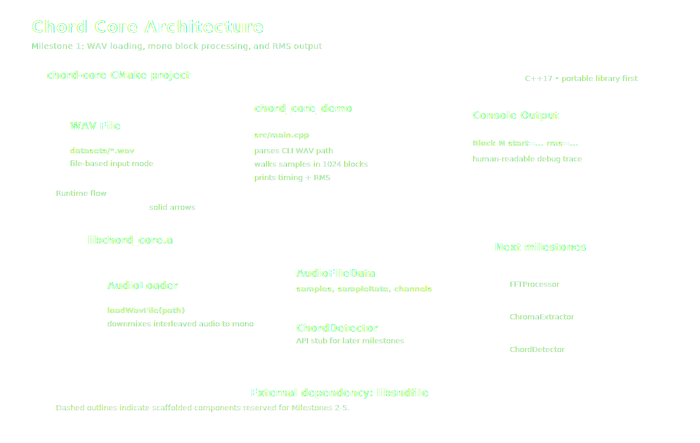

# chord-core

C++ library to analyze audio and provide chord names.

## Milestone 1

This repository currently provides:

- A C++17 CMake project
- WAV loading through `libsndfile`
- Block-based file processing with a default block size of 1024 samples
- RMS calculation and console output for each block
- Stubbed library components for the later FFT, chroma, and chord-detection milestones



## Dependencies

- CMake 3.16+
- A C++17 compiler
- `libsndfile`
- GoogleTest (only needed when `CHORD_CORE_BUILD_TESTS=ON`)

Examples:

- macOS (Homebrew): `brew install libsndfile googletest`
- Ubuntu/Debian: `sudo apt-get install libsndfile1-dev libgtest-dev`

## Build

```bash
cmake -S . -B build -DCHORD_CORE_BUILD_TESTS=OFF
cmake --build build
```

## Run

```bash
./build/chord_core_demo /path/to/file.wav
```

## Test

The standard test workflow includes line and branch coverage:

```bash
cmake --fresh -S . -B build-coverage \
  -DCHORD_CORE_BUILD_TESTS=ON \
  -DCHORD_CORE_ENABLE_COVERAGE=ON \
  -DCMAKE_BUILD_TYPE=Debug

cmake --build build-coverage --target coverage
```

This runs the unit tests, prints a coverage summary, and writes an HTML report to `build-coverage/coverage.html`.

Optional dependency:

- macOS (Homebrew): `brew install gcovr`
- Ubuntu/Debian: `sudo apt-get install gcovr`

For a faster test-only build without coverage:

```bash
cmake -S . -B build -DCHORD_CORE_BUILD_TESTS=ON
cmake --build build
ctest --test-dir build --output-on-failure
```

## Coverage

The `coverage` target wraps the full coverage flow in one command after configuration:

```bash
cmake --build build-coverage --target coverage
```

Coverage must be generated from a build tree configured with `-DCHORD_CORE_ENABLE_COVERAGE=ON`.
On macOS/AppleClang, CMake configures `gcovr` to use `xcrun llvm-cov gcov` automatically.
